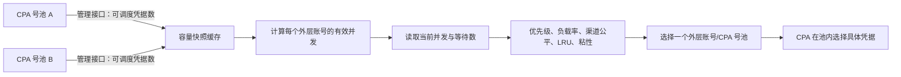

# CPA 多号池动态负载分配说明

本文档说明 Sub2API 当前如何感知多个 CLIProxyAPI（下文简称 CPA）号池的可用容量，并在 Sub2API 调度层动态调整请求分配。

## 1. 能力边界

当前实现包含两层调度：

1. Sub2API 在多个外层 API Key 账号之间选择一个账号。一个开启“CPA 并发联动”的外层账号应对应一个物理 CPA 号池。
2. 请求进入选中的 CPA 号池后，由 CPA 自己选择池内的具体凭据。

因此，Sub2API 能调整“请求进入哪个号池”，但不会直接指定 CPA 使用池内的哪个凭据。

这是一种按容量和实时利用率进行的动态调整，不是严格实时、严格按比例的全局负载均衡。容量变化通常最多有 90 秒感知延迟；优先级、渠道公平、会话粘性和账号运行状态也会影响最终选择。

## 2. 调度流程



对每个开启 CPA 并发联动的外层账号，Sub2API 请求 CPA 管理接口：

```text
GET {cpa_management_url}/v0/management/auth-files
Authorization: Bearer {cpa_management_key}
```

如果管理地址已经以 `/v0/management` 或 `/v0/management/auth-files` 结尾，系统会避免重复拼接路径。

## 3. 可调度凭据与有效容量

### 3.1 可调度凭据

响应中的凭据符合下列任一条件时不计入容量：

- `disabled=true`；
- `status` 忽略大小写后等于 `disabled`；
- `unavailable=true`，并且 `next_retry_after` 仍在未来。

其他凭据计入当前可调度凭据数。

### 3.2 有效并发

计算公式为：

```text
池计算容量 = 可调度凭据数 × 单凭据折算并发

本地并发上限 > 0 时：
有效并发 = min(本地并发上限, 池计算容量)

本地并发上限 <= 0 时：
有效并发 = 池计算容量
```

示例：

| 号池 | 可调度凭据 | 单凭据折算并发 | 本地并发上限 | 有效并发 |
| --- | ---: | ---: | ---: | ---: |
| A | 20 | 2 | 100 | 40 |
| B | 5 | 2 | 100 | 10 |
| C | 20 | 2 | 30 | 30 |

池内没有可调度凭据，或者无法获得可用容量快照时，该外层账号会从本次候选中排除。

## 4. 动态负载分配

调度器为候选账号批量读取 Redis 中的当前并发和等待数量，并计算：

```text
负载率 = (当前并发 + 等待数量) × 100 / 负载因子
```

未手工设置 `load_factor` 时，负载因子使用前述有效并发。相同优先级下，调度器优先尝试负载率更低的号池。

以上表示例中的 A、B 两池为例，如果它们的分组、平台、优先级和其他调度条件相同，并且没有手工负载因子或粘性会话干扰，调度器会让两池的利用率趋于接近。稳定负载下，A 的承载量通常会接近 B 的 4 倍，但不保证每个短时间窗口都严格达到 `4:1`。

账号选择的主要顺序是：

1. 模型、端点能力、账号状态、运行时封禁等硬过滤；
2. 优先级，数值更小的优先级先使用；
3. 相同优先级内比较负载率；
4. 同负载等级下考虑 API Key 渠道公平和最近最少使用；
5. 会话粘性等兼容策略可能优先复用已经绑定的账号。

## 5. 推荐配置

要让多号池按容量动态分配，建议遵守以下约束：

### 5.1 一个物理池对应一个外层账号

不要让多个 Sub2API 外层账号指向相同的 CPA 管理地址和管理员 Key。相同管理地址与 Key 会共享同一份容量快照，但每个外层账号仍会被当成独立容量参与调度，可能重复计算物理池容量并导致过量准入。

### 5.2 保持调度条件一致

需要共同分担流量的账号应满足：

- 位于相同分组；
- 使用相同平台；
- 使用相同优先级；
- 具备相同请求所需的模型和端点能力。

优先级不是容量权重。数值更小的优先级会优先使用，只有高优先级池饱和、被排除或不兼容时，才会进入下一优先级。

### 5.3 通常不要设置 `load_factor`

手工设置为正数的 `load_factor` 会优先于动态有效并发参与负载率计算，从而屏蔽号池容量变化对调度权重的影响。动态并发仍约束实际槽位获取，因此错误的手工负载因子还可能增加无效尝试或等待。

只有确实需要人为偏置流量时才设置 `load_factor`；需要按 CPA 实际容量自动调整时应将它留空。

### 5.4 正确设置单凭据折算并发

`cpa_concurrency_per_credential` 表示一个可调度凭据可承载的并发数，允许范围为 `1` 到 `10000`，默认值为 `1`。应依据上游真实限制和稳定性设置，不应仅为了提高表面容量而调大。

## 6. 管理后台配置

CPA 并发联动只支持 API Key 类型账号。在管理后台编辑账号时：

1. 打开“CPA 并发联动”。
2. 填写“CPA 管理地址”，必须是绝对 HTTP 或 HTTPS 地址，不能包含用户信息、查询参数或 fragment。
3. 填写“CPA 管理员 Key”。
4. 设置“单凭据折算并发”。
5. 设置外层账号的本地并发上限；需要按池计算容量作为唯一上限时可使用系统允许的无限制值。
6. 将需要共同分流的账号调整为相同优先级，并清除手工负载因子。

底层凭据字段为：

| 字段 | 含义 |
| --- | --- |
| `cpa_mode` | 是否启用 CPA 并发联动 |
| `cpa_management_url` | CPA 管理接口基础地址 |
| `cpa_management_key` | CPA 管理员 Key |
| `cpa_concurrency_per_credential` | 单个可调度凭据折算的并发数 |

管理员 Key 属于敏感凭据，不应写入日志、公开配置、工单截图或本文档示例。

## 7. 缓存、超时与故障行为

| 项目 | 当前行为 |
| --- | --- |
| 正常容量快照有效期 | 90 秒 |
| 失败后的旧快照最长使用时间 | 180 秒 |
| CPA 管理请求超时 | 2 秒 |
| 管理响应读取上限 | 2 MiB |
| 并发刷新合并 | 相同管理地址与 Key 使用 singleflight 合并 |
| HTTP 重定向 | 不跟随 |

典型故障行为：

| 场景 | 调度结果 |
| --- | --- |
| 首次读取管理接口失败，没有旧快照 | 排除该 CPA 外层账号 |
| 已有快照，刷新失败且快照未超过 180 秒 | 临时继续使用旧容量 |
| 旧快照超过 180 秒且刷新仍失败 | 排除该 CPA 外层账号 |
| 可调度凭据数为 0 | 排除该 CPA 外层账号 |
| 管理响应不是 HTTP 200，或无法在 2 MiB 读取上限内解析 | 视为容量读取失败 |

失败时后端会记录 `cpa_pool_capacity_unavailable` 警告，其中包含外层账号 ID、管理地址和错误，但不会记录管理员 Key。

## 8. 渠道公平与会话粘性

OpenAI 兼容 API Key 账号还会按标准化后的上游 `base_url` 识别渠道。在优先级和负载等级相同的候选中，调度器会交错不同渠道，避免某个渠道仅因外层账号数量更多而天然占据全部选择位置。

这意味着：

- 多个 CPA 号池使用不同上游地址时，渠道公平可能影响短时间内的精确容量比例；
- 多个账号使用相同标准化上游地址时，它们属于同一渠道，但账号级负载率仍会参与选择；
- 开启或命中会话粘性时，同一会话可能继续使用原号池，直到账号不再可用或粘性策略允许逃逸。

因此，容量比例用于控制长期承载能力，不应被理解为逐请求的固定轮询比例。

## 9. 运维检查

### 9.1 检查 CPA 管理接口

在有权限的运维环境中请求管理接口，确认返回 HTTP 200 且包含 `files` 数组：

```bash
export CPA_POOL_URL='https://cpa.example.com'
export CPA_POOL_MANAGEMENT_KEY='replace-with-secret'
curl -fsS \
  -H "Authorization: Bearer ${CPA_POOL_MANAGEMENT_KEY}" \
  -H 'Accept: application/json' \
  "${CPA_POOL_URL}/v0/management/auth-files"
```

不要把带有真实管理员 Key 的命令历史或输出提交到仓库。

### 9.2 检查分流配置

逐个确认参与分流的外层账号：

- 是否为 API Key 类型并处于可调度状态；
- `cpa_mode` 是否启用；
- 管理地址和管理员 Key 是否对应正确的物理池；
- 分组、平台和优先级是否一致；
- `load_factor` 是否为空；
- 本地并发上限是否意外压低池计算容量；
- 模型、端点能力和渠道限制是否使某个池无法进入候选。

### 9.3 判断是否正常动态调整

1. 记录各池当前可调度凭据数和计算出的预期有效并发。
2. 使用持续并发请求观察各外层账号的当前并发与等待数，而不是只比较累计请求数。
3. 等待至少一个 90 秒容量刷新窗口后，再判断增减 CPA 凭据是否已经反映。
4. 比较各池负载率是否趋近，而不是要求累计请求数绝对相等。
5. 若同一内容或同一会话持续集中到一个池，检查会话粘性，不要先把它误判为容量同步失效。

## 10. 已知限制

- 容量来自 CPA 管理接口的周期快照，不是推送或逐请求实时数据。
- 当前只同步“可调度凭据数量”，不会读取每个凭据不同的限额、RPM、余额或实际并发能力。
- 所有凭据使用同一个 `cpa_concurrency_per_credential` 折算值。
- Sub2API 不掌握 CPA 池内的最终选凭据算法和池内排队情况。
- 手工负载因子、硬优先级、渠道公平、会话粘性和请求能力过滤都会使短期分布偏离容量比例。
- 多实例 Sub2API 的容量快照是进程内缓存；各实例的刷新时刻可能不同，但每个实例都遵守相同的有效期和失败策略。

## 11. 实现位置

- CPA 配置校验、容量请求、缓存和有效并发计算：`backend/internal/application/service/cpa_pool_capacity.go`
- OpenAI 调度前应用 CPA 容量：`backend/internal/application/service/openai_gateway_scheduling.go`
- 通用网关调度前应用 CPA 容量：`backend/internal/application/service/gateway_scheduling.go`
- 账号负载因子回退逻辑：`backend/internal/application/service/account.go`
- Redis 并发、等待数和负载率计算：`backend/internal/infrastructure/repository/concurrency_cache.go`
- OpenAI API Key 渠道交错：`backend/internal/application/service/openai_channel_balancer.go`
