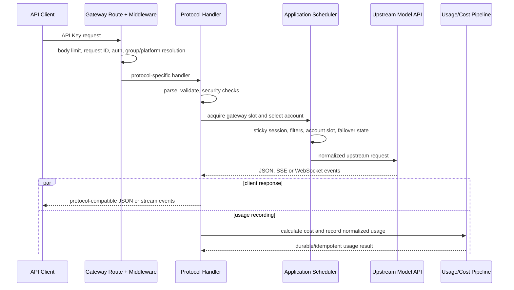
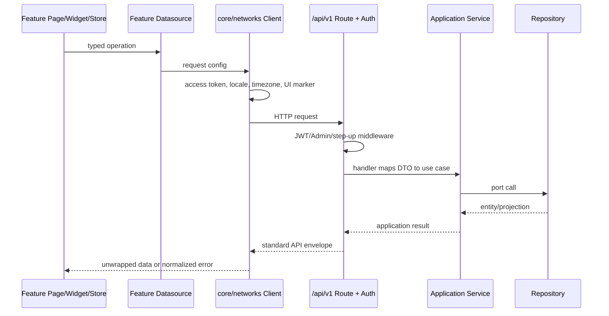

# Sub2API 关键请求链路

本文给出高频链路的阅读顺序和不变量。它刻意省略平台内部的全部分支；调试具体问题时，应从命中的路由和 handler 继续追踪。

## API Key 模型请求

典型入口包括 `/v1/messages`、`/v1/responses`、`/v1/chat/completions`、`/v1beta/...` 以及无 `/v1` 的兼容别名。所有绑定在 `backend/internal/transport/http/server/routes/gateway.go`。



流式事件可能在最终用量落库前已经发送给客户端；因此记录必须幂等、有界兜底，且不能依赖客户端连接继续存活。

### 阅读顺序

1. `routes/gateway.go`：确认实际命中路径、middleware 顺序和平台分流。
2. `server/middleware/api_key_auth.go`：确认 API Key、唯一管理员和分组路由信息如何进入 context。
3. 协议 handler：Anthropic 从 `gateway_handler_messages.go`，OpenAI Responses 从 `openai_gateway_responses.go` 开始。
4. `application/service/gateway_scheduling.go` 或 `openai_account_scheduler.go`：确认候选账号和会话粘性。
5. 对应 `gateway*_forward*` / `openai*_forward*`：确认上游请求与响应转换。
6. `gateway_usage_billing.go` 或 `openai_gateway_usage.go`：确认用量解析、成本计算和记录提交。

### 关键不变量

- API Key auth 完成后，handler 从 context 读取完整 auth subject，不自行重查一套不一致的身份。
- 等待槽位后必须再次检查 API Key 和上游账号是否仍可调度。
- 账号槽位、调用方槽位和图片槽位在所有返回与取消路径释放。
- failover 必须记录失败账号并受最大切换次数约束。
- SSE/WS 一旦开始写出，后续错误使用流协议事件；未开始写出时才可返回普通 HTTP JSON 错误。
- 客户端取消应停止上游读取和后台转发，不能继续占用账号或累计无主缓存。

## 浏览器管理请求

浏览器 API 主要位于 `/api/v1/...`。前端不直接拼接鉴权、刷新或统一错误逻辑。



### 阅读顺序

1. `frontend/src/core/routes/index.ts` 找 feature page 和权限元数据。
2. `frontend/src/features/<domain>/presentation/` 找页面编排，再跟 import 到 widget/composable/store。
3. 在同一 feature 的 `data/datasources/` 找请求封装；统一拦截行为在 `frontend/src/core/networks/client.ts`。
4. 后端 `routes/auth.go`, `user.go` 或 `admin.go` 找精确路由。
5. 跟到 handler、application service 接口和 infrastructure repository。

跨功能复用 UI/交互位于 `frontend/src/common/`；应用级 Router、网络、i18n、主题和全局 Store 位于 `frontend/src/core/`。`frontend/src/api/` 与 `frontend/src/stores/` 只保留旧导入的过渡兼容 barrel，排障时必须继续追到实际 feature/core owner。

### 认证刷新

短期 access token 保存在前端内存中，请求由 `core/networks/client.ts` 添加 `Authorization`。刷新凭据留在 HttpOnly cookie；401 时通过 `core/networks/sessionRefresh.ts` 合并并发刷新，token 内存状态由 `core/networks/tokenStore.ts` 管理，再重试原请求。页面不得直接读取刷新 cookie 或各自实现刷新队列。

登录和会话业务由 `features/auth/data/datasources/authDatasource.ts` 与 `features/auth/presentation/stores/authStore.ts` 拥有；网络级刷新和请求重试仍由 `core/networks/` 统一负责。

管理员路由的前端 guard 只改善体验。真正的管理员权限、step-up 和 scoped Admin API Key 校验在后端 middleware。

### 单管理员认证边界

本支线只注册本地管理员的凭证公钥、密码登录、TOTP、Passkey、刷新、登出和会话撤销接口。没有注册、找回密码、用户 OAuth 或第三方身份源入口。`BackendModeAuthGuard` 以固定允许列表防止这些自助认证路径被重新暴露；密码登录还要求浏览器凭证信封并接受本地与 Redis 双层限流。

阅读顺序：`server/routes/auth.go` -> `server/middleware/backend_mode_guard.go` -> `handler/auth_handler.go` / `handler/passkey_handler.go` -> `application/service/auth_service.go`、`passkey.go`、`totp_service.go`。前端从 `features/auth/` 追到 `core/networks/sessionRefresh.ts`。

## 用量与成本

Anthropic 兼容和 OpenAI 兼容 handler 分别调用自己的 `RecordUsage` 入口，但最终共享成本计算、幂等用量写入和统计语义。`ActualCost` 是应用分组倍率后的分析值，不会扣减用户余额或订阅额度。

```text
handler success/usage
  -> GatewayService.RecordUsage or OpenAIGatewayService.RecordUsage
  -> BillingService.CalculateCostUnified
  -> build UsageLog with standard/rated/account costs
  -> UsageLogRepository.CreateBestEffort
  -> bounded in-process batch insert
  -> synchronous PostgreSQL fallback on timeout or batch failure
```

核心文件：

- `backend/internal/application/service/gateway_usage_billing.go`
- `backend/internal/application/service/openai_gateway_usage.go`
- `backend/internal/application/service/billing_service.go`
- `backend/internal/infrastructure/repository/usage_log_repo.go`
- `backend/internal/infrastructure/repository/usage_log_repo_insert.go`
- `backend/internal/infrastructure/repository/usage_log_repo_stats.go`

### 关键不变量

- `CalculateCostUnified` 是 token、按次、图片和视频等模式的统一成本入口。
- 标准费用、倍率费用和账号成本是分析维度，不是下游钱包或订阅结算。
- request ID + API Key 用于幂等；重复记录必须由数据库冲突保护收敛。
- 批处理队列有固定容量；入队或批写超时后使用新的有界 context 同步落库，不能静默丢弃。
- 修改成本逻辑时同时验证倍率、价格来源、重复提交、并发提交和写入故障兜底。

## 启动与后台任务

```text
cmd/server/main.go
  -> setup detection or config.LoadForBootstrap
  -> initializeApplication (Wire)
  -> repositories/services/handlers/server providers
  -> HTTP listener + background workers
  -> signal
  -> application cleanup
  -> Redis/Ent/SQL close
```

后台任务包括但不限于用量批写、缓存失效、调度快照、凭据刷新、过期清理、Ops 聚合和异步图片任务。它们的构造与停止依赖集中在 `backend/cmd/server/wire.go` 和生成的 `wire_gen.go`。

新增后台任务必须具备：明确 owner、可取消 context/Stop、有限并发和队列、幂等或可恢复语义，以及在 `Application.Cleanup` 中正确停止的路径。

## 前端开发与生产构建

开发模式：

```text
pnpm dev (Vite) -> /api proxy or configured backend
go run ./cmd/server (Go backend)
```

生产构建：

```text
frontend/src
  -> main.ts + core/routes + feature presentation/data
  -> pnpm run build
  -> backend/internal/transport/webassets/dist
  -> go build ./cmd/server
  -> embedded frontend served by transport/webassets
```

后端可在 HTML 中注入公开运行设置，前端 `main.ts` 在挂载前读取这些设置，加载 `core/themes/style.css`，随后初始化 `core/i18n` 和 `core/routes`。修改品牌、登录方式或前台能力开关时，要同时检查注入 DTO、setting service、`core/stores/appStore.ts` 和首屏行为。

## 故障定位起点

| 现象 | 第一检查点 |
| --- | --- |
| 路径 404/走错平台 | `routes/gateway.go` 和 composite/force-platform middleware |
| API Key 401/403 | API Key auth context、启用状态和分组路由要求 |
| 一直选中同一账号 | session hash、粘性缓存、候选过滤和失败账号集合 |
| 503/429 后反复调度坏账号 | 错误分类、临时不可调度状态、scheduler exclusion |
| 流式响应头或错误格式异常 | handler 写出时机、SSE headers、stream-started 分支 |
| 前端登录循环 | `core/networks/client.ts` 刷新合并、session refresh API、`features/auth` store、`core/routes` guard |
| 用量成本缺失或重复 | RecordUsage、best-effort batch、同步 fallback、request ID + API Key 唯一约束 |

功能到文件的更完整映射见 [代码地图](CODE_MAP.md)。
