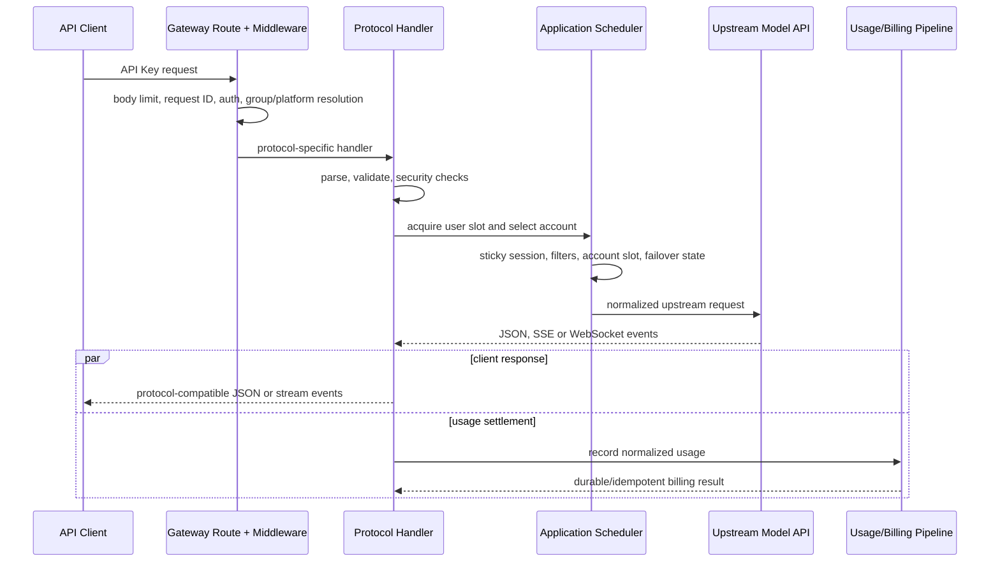
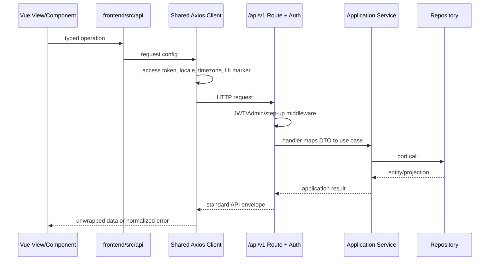

# Sub2API 关键请求链路

本文给出高频链路的阅读顺序和不变量。它刻意省略平台内部的全部分支；调试具体问题时，应从命中的路由和 handler 继续追踪。

## API Key 模型请求

典型入口包括 `/v1/messages`、`/v1/responses`、`/v1/chat/completions`、`/v1beta/...` 以及无 `/v1` 的兼容别名。所有绑定在 `backend/internal/transport/http/server/routes/gateway.go`。



流式事件可能在最终用量结算前已经发送给客户端；这也是结算必须可恢复、幂等且不能依赖客户端连接继续存活的原因。

### 阅读顺序

1. `routes/gateway.go`：确认实际命中路径、middleware 顺序和平台分流。
2. `server/middleware/api_key_auth.go`：确认 API Key、用户、分组和订阅如何进入 context。
3. 协议 handler：Anthropic 从 `gateway_handler_messages.go`，OpenAI Responses 从 `openai_gateway_responses.go` 开始。
4. `application/service/gateway_scheduling.go` 或 `openai_account_scheduler.go`：确认候选账号和会话粘性。
5. 对应 `gateway*_forward*` / `openai*_forward*`：确认上游请求与响应转换。
6. `gateway_usage_billing.go` 或 `openai_gateway_usage.go`：确认用量解析和计费提交。

### 关键不变量

- API Key auth 完成后，handler 从 context 读取完整 auth subject，不自行重查一套不一致的身份。
- 获取用户槽位后必须再次检查计费资格；排队期间余额、订阅或平台额度可能变化。
- 账号槽位、用户槽位和图片槽位在所有返回与取消路径释放。
- failover 必须记录失败账号并受最大切换次数约束。
- SSE/WS 一旦开始写出，后续错误使用流协议事件；未开始写出时才可返回普通 HTTP JSON 错误。
- 客户端取消应停止上游读取和后台转发，不能继续占用账号或累计无主缓存。

## 浏览器管理请求

浏览器 API 主要位于 `/api/v1/...`。前端不直接拼接鉴权、刷新或统一错误逻辑。



### 阅读顺序

1. `frontend/src/router/index.ts` 找页面和权限元数据。
2. `frontend/src/views/<domain>/` 找页面编排，再跟 import 到 component/composable/store。
3. `frontend/src/api/` 找请求封装；统一拦截行为在 `api/client.ts`。
4. 后端 `routes/auth.go`, `user.go`, `admin.go` 或 `payment.go` 找精确路由。
5. 跟到 handler、application service 接口和 infrastructure repository。

### 认证刷新

短期 access token 保存在前端内存中，请求由 `api/client.ts` 添加 `Authorization`。刷新凭据留在 HttpOnly cookie；401 时通过 `api/sessionRefresh.ts` 合并并发刷新，再重试原请求。页面不得直接读取刷新 cookie 或各自实现刷新队列。

管理员路由的前端 guard 只改善体验。真正的管理员权限、step-up 和 scoped Admin API Key 校验在后端 middleware。

## 用量与计费

Anthropic 兼容和 OpenAI 兼容 handler 分别调用自己的 `RecordUsage` 入口，但最终共享统一成本计算和持久结算语义。

```text
handler success/usage
  -> GatewayService.RecordUsage or OpenAIGatewayService.RecordUsage
  -> BillingService.CalculateCostUnified
  -> applyUsageBilling
  -> UsageBillingRepository.Apply
  -> queuedUsageBillingRepository (Redis Stream when enabled)
  -> usageBillingRepository (PostgreSQL transaction + idempotency)
  -> billing/auth/cache projection refresh + separate usage-log write
```

核心文件：

- `backend/internal/application/service/gateway_usage_billing.go`
- `backend/internal/application/service/openai_gateway_usage.go`
- `backend/internal/application/service/billing_service.go`
- `backend/internal/infrastructure/repository/usage_billing_queue.go`
- `backend/internal/infrastructure/repository/usage_billing_repo.go`
- `backend/internal/infrastructure/repository/billing_cache.go`

### 关键不变量

- `CalculateCostUnified` 是 token、按次和图片等计费模式的统一成本入口。
- request ID 与请求指纹用于幂等；同一 ID 的不同请求不能被静默视为重复。
- PostgreSQL 结算事务内完成幂等占位以及余额、订阅、API Key/账号额度等账务效果。
- usage log 是相邻的独立写入，不与结算事务共享原子性；排障时不能仅凭日志是否存在判断扣费是否成功。
- 队列满、worker 拒绝或 Redis 不可用时，关键结算必须进入受限 fallback 或同步执行，不能丢弃。
- 缓存回填使用版本/新旧保护，避免旧数据库快照覆盖更晚的扣费结果。
- 修改计费时同时验证余额模式、订阅模式、重复提交、并发提交和故障恢复。

## 启动与后台任务

```text
cmd/server/main.go
  -> setup detection or config.LoadForBootstrap
  -> initializeApplication (Wire)
  -> repositories/services/handlers/server providers
  -> HTTP listener + background workers
  -> signal
  -> application cleanup
  -> Redis/Ent/SQL close
```

后台任务包括但不限于用量结算、缓存失效、调度快照、凭据刷新、过期清理、Ops 聚合、图片任务和支付订单处理。它们的构造与停止依赖集中在 `backend/cmd/server/wire.go` 和生成的 `wire_gen.go`。

新增后台任务必须具备：明确 owner、可取消 context/Stop、有限并发和队列、幂等或可恢复语义，以及在 `Application.Cleanup` 中正确停止的路径。

## 前端开发与生产构建

开发模式：

```text
pnpm dev (Vite) -> /api proxy or configured backend
go run ./cmd/server (Go backend)
```

生产构建：

```text
frontend/src
  -> pnpm run build
  -> backend/internal/transport/webassets/dist
  -> go build ./cmd/server
  -> embedded frontend served by transport/webassets
```

后端可在 HTML 中注入公开运行设置，前端 `main.ts` 在挂载前读取这些设置，随后初始化 i18n 和 Router。修改品牌、登录方式或前台能力开关时，要同时检查注入 DTO、setting service、前端 app store 和首屏行为。

## 故障定位起点

| 现象 | 第一检查点 |
| --- | --- |
| 路径 404/走错平台 | `routes/gateway.go` 和 composite/force-platform middleware |
| API Key 401/403 | API Key auth context、分组要求、billing eligibility |
| 一直选中同一账号 | session hash、粘性缓存、候选过滤和失败账号集合 |
| 503/429 后反复调度坏账号 | 错误分类、临时不可调度状态、scheduler exclusion |
| 流式响应头或错误格式异常 | handler 写出时机、SSE headers、stream-started 分支 |
| 前端有余额但网关拒绝 | 展示余额、pending/frozen 状态、billing cache 与准入一起检查 |
| 前端登录循环 | `api/client.ts` 刷新合并、session refresh API、路由 guard |
| 用量存在但余额未扣/重复扣 | RecordUsage、queue、幂等 key、DB transaction、cache refresh |

功能到文件的更完整映射见 [代码地图](CODE_MAP.md)。
